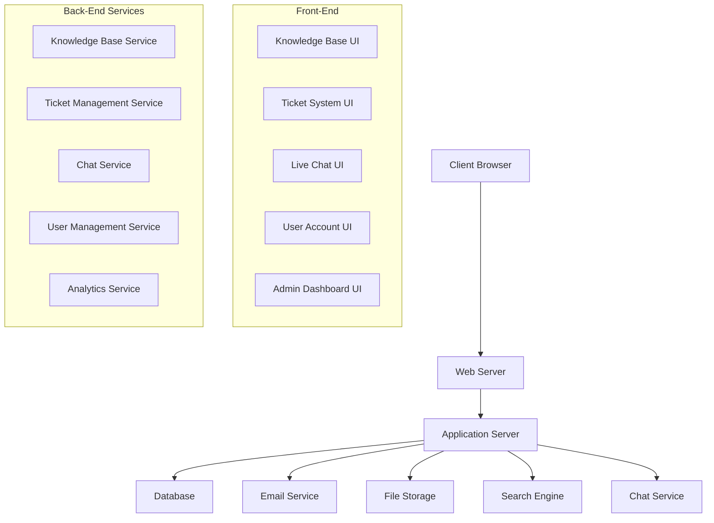

# Design Document: Customer Support Portal

## Overview

The Customer Support Portal will be a comprehensive solution integrated into the existing Valuenable website. It will provide customers with self-service options through a knowledge base, a ticket management system for personalized support, live chat capabilities for immediate assistance, and account management features. The portal will also include an administrative dashboard for support staff to monitor and manage support activities.

## Architecture

The Customer Support Portal will follow a modular architecture to ensure scalability and maintainability. The system will be built using a combination of client-side and server-side technologies.

### High-Level Architecture



### Technology Stack

1. **Front-End**:
   - HTML5, CSS3, JavaScript
   - Bootstrap for responsive design
   - jQuery for DOM manipulation
   - Custom CSS to match Valuenable's existing design

2. **Back-End**:
   - Server-side language compatible with the existing website
   - RESTful API for client-server communication
   - Database for storing user data, tickets, and knowledge base articles
   - WebSocket for real-time chat functionality

3. **Third-Party Integrations**:
   - Email service for notifications
   - File storage for attachments
   - Search engine for knowledge base

## Components and Interfaces

### 1. Knowledge Base Component

#### Interface
- Article listing page with categories and search functionality
- Article detail page with content, related articles, and feedback options
- Article search results page

#### Data Flow
1. User navigates to knowledge base or performs a search
2. System retrieves articles from the database based on category or search query
3. System displays articles to the user
4. User can view full articles and provide feedback
5. System logs user interactions for analytics

### 2. Support Ticket System Component

#### Interface
- Ticket submission form
- Ticket listing page showing status and basic information
- Ticket detail page with conversation history
- Ticket management interface for support agents

#### Data Flow
1. User submits a new ticket with details and optional attachments
2. System generates a unique ticket ID and stores the ticket in the database
3. System sends a confirmation email to the user
4. Support agent receives notification of new ticket
5. User and agent can add responses to the ticket
6. System updates ticket status and notifies relevant parties

### 3. Live Chat Component

#### Interface
- Chat icon/button visible throughout the portal
- Chat window with message history and input field
- Queue status indicator
- Post-chat feedback form

#### Data Flow
1. User initiates chat by clicking the chat icon
2. System checks for available agents
3. If agents are available, system establishes a connection
4. If no agents are available, system places user in queue
5. Messages are exchanged in real-time using WebSockets
6. Chat history is stored in the database
7. User can provide feedback after the chat ends

### 4. User Account Management Component

#### Interface
- Registration form
- Login form
- Profile management page
- Password reset functionality

#### Data Flow
1. User registers or logs in
2. System authenticates user credentials
3. User can view and update profile information
4. System stores user data securely in the database
5. User can reset password through email verification

### 5. Support Dashboard Component

#### Interface
- Overview dashboard with key metrics
- Agent performance reports
- Ticket analytics with filtering options
- Export functionality for reports

#### Data Flow
1. Admin logs into the dashboard
2. System retrieves metrics and analytics data from the database
3. System displays visualizations and reports
4. Admin can filter data by various parameters
5. Admin can export data in different formats

## Data Models

### User Model
```json
{
  "userId": "string (unique identifier)",
  "email": "string (unique)",
  "passwordHash": "string",
  "firstName": "string",
  "lastName": "string",
  "phoneNumber": "string (optional)",
  "company": "string (optional)",
  "role": "enum (customer, agent, admin)",
  "createdAt": "datetime",
  "lastLogin": "datetime",
  "preferences": {
    "emailNotifications": "boolean",
    "language": "string"
  }
}
```

### Ticket Model
```json
{
  "ticketId": "string (unique identifier)",
  "subject": "string",
  "description": "string",
  "status": "enum (open, in_progress, waiting_for_customer, resolved, closed)",
  "priority": "enum (low, medium, high, urgent)",
  "category": "string",
  "createdBy": "userId",
  "assignedTo": "userId (optional)",
  "createdAt": "datetime",
  "updatedAt": "datetime",
  "attachments": [
    {
      "fileId": "string",
      "fileName": "string",
      "fileType": "string",
      "fileSize": "number",
      "uploadedAt": "datetime"
    }
  ],
  "messages": [
    {
      "messageId": "string",
      "sender": "userId",
      "content": "string",
      "sentAt": "datetime",
      "attachments": ["fileId"]
    }
  ]
}
```

### Knowledge Base Article Model
```json
{
  "articleId": "string (unique identifier)",
  "title": "string",
  "content": "string (HTML)",
  "category": "string",
  "tags": ["string"],
  "author": "userId",
  "createdAt": "datetime",
  "updatedAt": "datetime",
  "publishedAt": "datetime",
  "status": "enum (draft, published, archived)",
  "helpfulCount": "number",
  "notHelpfulCount": "number",
  "viewCount": "number",
  "relatedArticles": ["articleId"]
}
```

### Chat Session Model
```json
{
  "sessionId": "string (unique identifier)",
  "userId": "string (can be null for anonymous)",
  "agentId": "string",
  "startTime": "datetime",
  "endTime": "datetime (null if active)",
  "status": "enum (waiting, active, ended)",
  "queuePosition": "number (null if not in queue)",
  "waitTime": "number (seconds)",
  "messages": [
    {
      "messageId": "string",
      "sender": "string (userId or agentId)",
      "content": "string",
      "sentAt": "datetime",
      "read": "boolean"
    }
  ],
  "rating": "number (1-5, null if not rated)",
  "feedback": "string"
}
```

## Error Handling

### Client-Side Error Handling
1. Form validation with clear error messages
2. Graceful handling of network errors with retry options
3. Fallback UI for components that fail to load

### Server-Side Error Handling
1. Structured error responses with appropriate HTTP status codes
2. Logging of errors for monitoring and debugging
3. Graceful degradation of services when dependencies are unavailable

### Error Categories and Responses
| Error Category | HTTP Status | User Message | Action |
|----------------|-------------|--------------|--------|
| Authentication | 401 | "Please log in to access this feature" | Redirect to login |
| Authorization | 403 | "You don't have permission to access this resource" | Show limited view |
| Not Found | 404 | "The requested resource was not found" | Show search/navigation options |
| Validation | 422 | "Please check your input and try again" | Highlight invalid fields |
| Server Error | 500 | "Something went wrong. Please try again later" | Retry with exponential backoff |

## Testing Strategy

### Unit Testing
- Test individual components and services in isolation
- Mock dependencies to ensure focused testing
- Achieve high code coverage for critical functionality

### Integration Testing
- Test interactions between components
- Verify data flow across the system
- Test third-party integrations with mock services

### End-to-End Testing
- Simulate user journeys through the portal
- Test complete workflows from start to finish
- Verify responsive design across different devices

### Performance Testing
- Load testing to ensure the system can handle expected traffic
- Stress testing to identify breaking points
- Response time monitoring for critical operations

### Accessibility Testing
- Ensure compliance with WCAG 2.1 AA standards
- Test with screen readers and keyboard navigation
- Verify color contrast and text readability

## Security Considerations

1. **Authentication and Authorization**
   - Secure password storage with strong hashing
   - Role-based access control
   - Session management with secure cookies

2. **Data Protection**
   - Encryption of sensitive data at rest and in transit
   - Input validation to prevent injection attacks
   - Output encoding to prevent XSS

3. **API Security**
   - Rate limiting to prevent abuse
   - Token-based authentication for API access
   - Validation of all input parameters

4. **Compliance**
   - GDPR compliance for user data
   - Audit logging for sensitive operations
   - Data retention policies

## Integration with Existing Website

1. **Visual Integration**
   - Match the existing Valuenable website design
   - Consistent header, footer, and navigation
   - Seamless transitions between main site and support portal

2. **Technical Integration**
   - Shared authentication system
   - Consistent URL structure
   - Cross-linking between main site and support portal

3. **User Flow Integration**
   - Support access points from multiple locations on the main site
   - Contextual help links that direct to relevant knowledge base articles
   - Smooth handoff between marketing content and support resources

## Deployment Strategy

1. **Phased Rollout**
   - Phase 1: Knowledge Base
   - Phase 2: Ticket System
   - Phase 3: Live Chat
   - Phase 4: Admin Dashboard

2. **Environment Setup**
   - Development environment for ongoing work
   - Staging environment for testing
   - Production environment with high availability

3. **Monitoring and Maintenance**
   - Performance monitoring
   - Error tracking and alerting
   - Regular security updates
   - Backup and recovery procedures